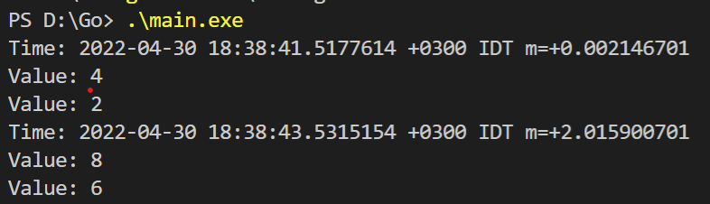

## Multithreading
## Lab 1

### Build
`go build main.go`

### Usage
`./main`

### Res output
<code>
Time: 2022-04-30 18:38:41.5177614 +0300 IDT m=+0.002146701  

Value: 4  
Value: 2  
Time: 2022-04-30 18:38:43.5315154 +0300 IDT m=+2.015900701  
Value: 8  
Value: 6  
</code> 

